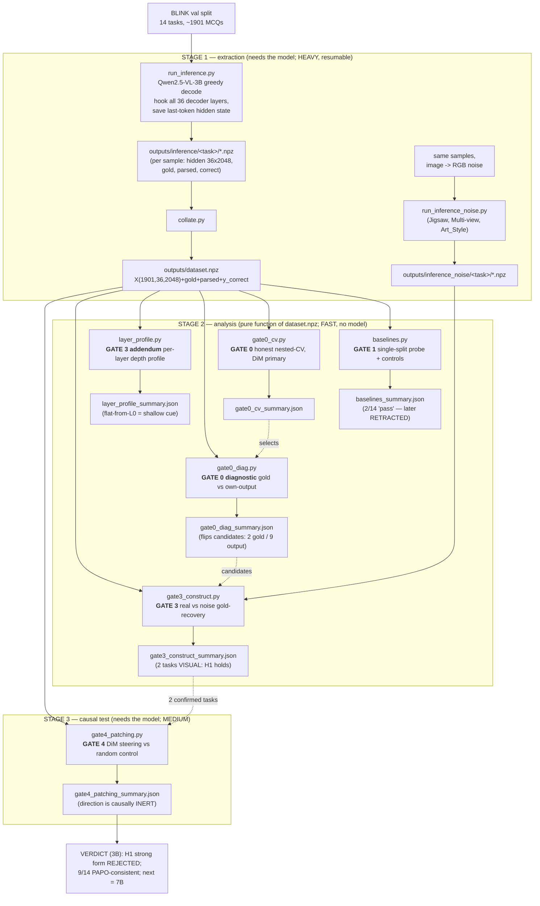

# Pipeline & Reproducibility — 2026-05-30

> **Purpose**: One picture + one runbook for the whole study. Anyone (or future-you) should be
> able to read this and regenerate every number in `pilot/outputs/*.json` from scratch. Pairs
> with `00_start_here.md` (state), `03_methodology_log.md` (per-gate reasoning), and
> `pilot/ENVIRONMENT.md` (exact versions + model commit).

---

## 1. The pipeline at a glance (data flow)



### ASCII fallback (same flow, no renderer needed)

```
BLINK (14 tasks, ~1901 MCQs)
        |
        v
[STAGE 1: EXTRACTION — needs model, slow, resumable]
  run_inference.py  --hook 36 layers-->  inference/<task>/*.npz  --collate.py-->  dataset.npz
  run_inference_noise.py (image->noise, 3 tasks)  ----------------------------->  inference_noise/<task>/*.npz
        |
        v
[STAGE 2: ANALYSIS — pure function of dataset.npz, fast, no model]
  GATE 1  baselines.py        -> 2/14 "pass"            ........ RETRACTED in Gate 0
  GATE 0  gate0_cv.py         -> honest nested-CV       ........ kills the 2 "winners"
  GATE 0d gate0_diag.py       -> gold vs own-output     ........ FLIPS candidates: 2 gold-readers, 9 output-readers
  GATE 3  gate3_construct.py  -> real vs noise image    ........ 2 tasks VISUAL (Jigsaw, Multi-view) => H1 holds
  GATE 3+ layer_profile.py    -> per-layer depth        ........ flat-from-L0 => shallow cue, NOT deep grounding
        |
        v
[STAGE 3: CAUSAL — needs model, medium]
  GATE 4  gate4_patching.py   -> steer vs random        ........ direction is INERT => H1 strong form REJECTED (3B)
        |
        v
VERDICT (3B): supports PAPO for 9/14; narrow shallow+inert signal for 2.  NEXT: scale to 7B.
```

---

## 2. What each gate *achieves* and *how* (the mechanism)

| Gate | Question it answers | How (mechanism) | Result artifact |
|---|---|---|---|
| **1** | Is there *any* probe signal? | Logistic-regression probe per task, single 25% split, best of 36 layers; + selectivity, vocab, DiM controls | `baselines_summary.json` |
| **0** | Was Gate 1 just luck? | **Nested 5-fold CV**: layer chosen on inner folds only; every sample predicted once; DiM primary; bootstrap CI | `gate0_cv_summary.json` |
| **0-diag** | Does the probe read the *correct* answer or the model's *own wrong* answer? | Read DiM's predicted letter on wrong subset; compare to gold vs `parsed` output | `gate0_diag_summary.json` |
| **3** | Is the gold signal *visual*? | Re-extract with image replaced by RGB **noise**; if gold-recovery collapses to chance, signal was visual | `gate3_construct_summary.json` |
| **3-add** | Is it *deep reasoning* or a *shallow cue*? | Per-layer CV gold-recovery; high-at-L0 + flat = shallow input cue, not emergent grounding | `layer_profile_summary.json` |
| **4** | Does the model *use* the direction? | **Activation steering**: add `alpha * (class-mean diff)` to the last prompt token at a mid-layer; measure flip-to-gold vs a random direction of equal norm | `gate4_patching_summary.json` |

Methodology citations: nested-CV / winner's-curse (Belinkov 2022, arXiv:2102.12452; Hewitt & Liang
2019, arXiv:1909.03368); DiM probe (Marks & Tegmark 2023, arXiv:2310.06824); construct validity /
counterfactual logic (Ravichander 2021, arXiv:2005.00719; Geiger 2021, arXiv:2106.02997); activation
patching/steering (Meng 2022, arXiv:2202.05262); knowledge–action gap (arXiv:2603.18353);
rebuttal target PAPO (Wang et al. ICLR 2026, arXiv:2507.06448); benchmark BLINK (Fu et al. ECCV 2024,
arXiv:2404.12390).

---

## 3. Runbook

```bash
cd pilot
python3 -m venv env && source env/bin/activate
pip install -r requirements.lock.txt          # exact pins; see ENVIRONMENT.md

./run_all.sh analysis   # ~2 min, no model: regenerates Gates 1/0/0-diag/3/3-add from dataset.npz
./run_all.sh full       # hours on Mac: also re-runs inference + Gate 4 (live model)
```

Stages are idempotent; inference is resumable (skips saved samples). Self-tests run first
(`gate0_cv.py --selftest` checks for train/test leakage; `gate4_patching.py --selftest` checks the
steering harness reproduces the original wrong answer).

---

## 4. Reproducibility status & remaining gaps

**Closed on 2026-05-30 (this pass):**
- ✅ The two load-bearing diagnostics that were **prose-only** are now regenerable and saved:
  `gate0_diag.py` → `gate0_diag_summary.json` (gold-vs-output) and `layer_profile.py` →
  `layer_profile_summary.json` (depth profile). **Both reproduce the docs' numbers** (Jigsaw
  0.99→gold; Multi-view 0.93→gold; 9 tasks →output; gold-acc flat ~1.0 from L0).
- ✅ Exact dependency pins (`requirements.lock.txt`) + runtime manifest + model commit hash
  (`ENVIRONMENT.md`). The old `requirements.txt` used loose `>=` bounds that would not reproduce.
- ✅ Single ordered runbook (`run_all.sh`) replacing scattered ad-hoc commands.

**Still open (planned):**
- ⏳ **Gate 2 (random-init baseline)** was specified (`reqs.md` §3.6 #3; `06` step G2) but **never
  run**. It rules out "the signal is just architecture, not learning." Cheap to add on 3B.
- ⏳ **Multiple-comparison correction (Benjamini–Hochberg FDR)** across the task×layer grid is
  specified (`reqs.md` §3.9; `03` Gate 3 table) but not in the committed code.
- ⏳ **Counterfactual image-swap** (the *primary* construct test in `06`/`08` D1) was replaced by the
  noise-image fallback because options are embedded in the image. Document this as a limitation or
  mine swap pairs for tasks where it's possible.
- ⏳ **7B replication** (`gate7b_dryrun.py` exists as a feasibility probe; the real run is pending a
  48 GB machine / GPU budget).
- ⏳ A frozen copy of `reqs.md` is **stale** vs. the executed study (says 7B not 3B; says INLP not
  activation patching; cites "Lin et al." for arXiv:2502.03628 which `07` corrects to "Li et al.").
  Reconcile before write-up.
